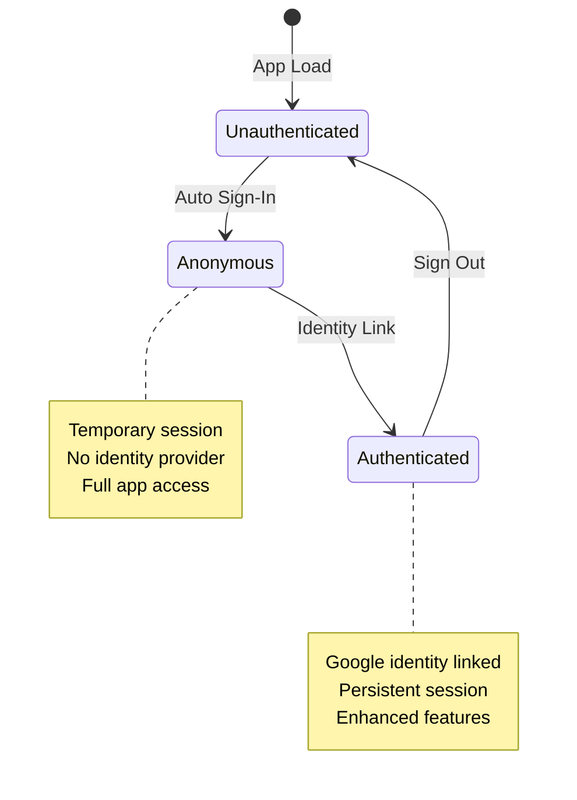
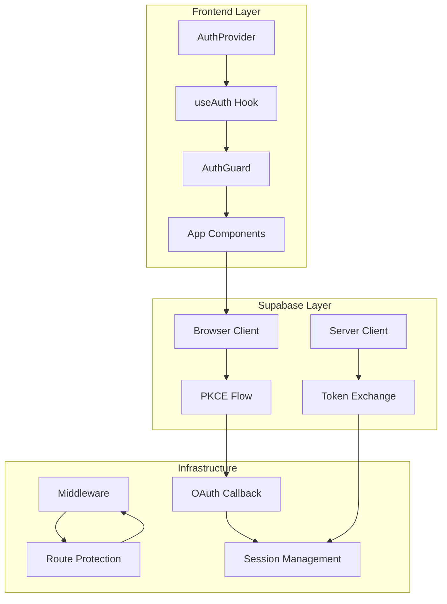
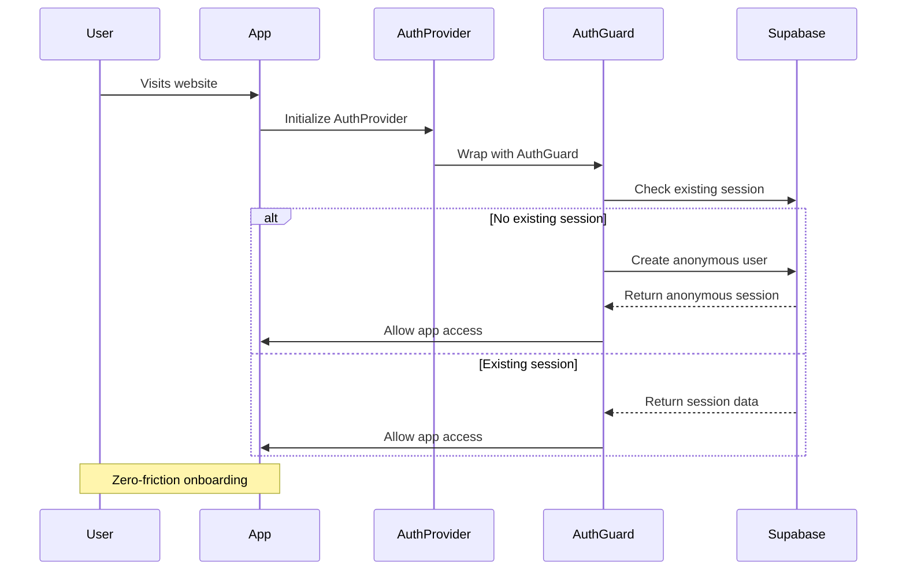
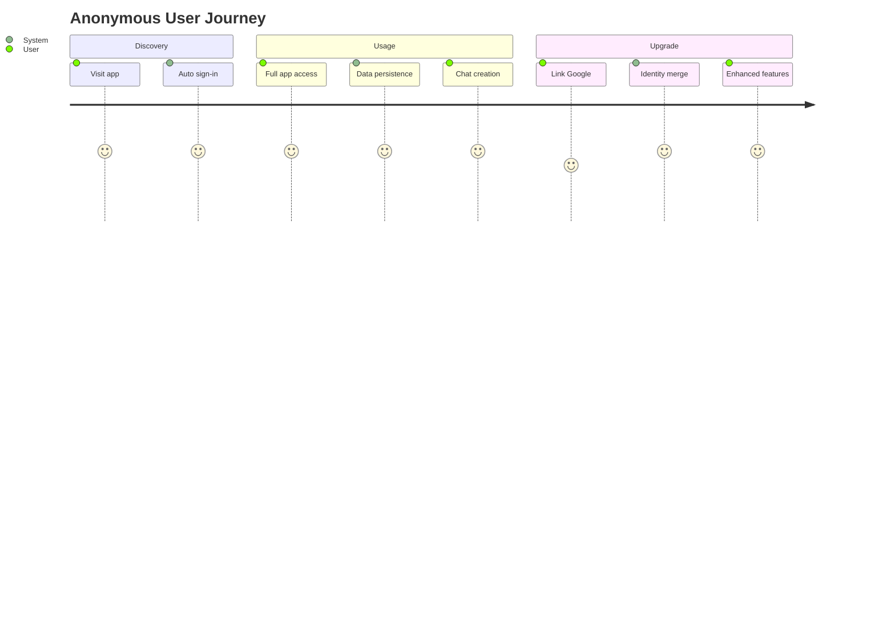
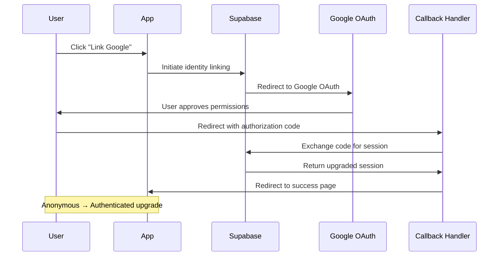
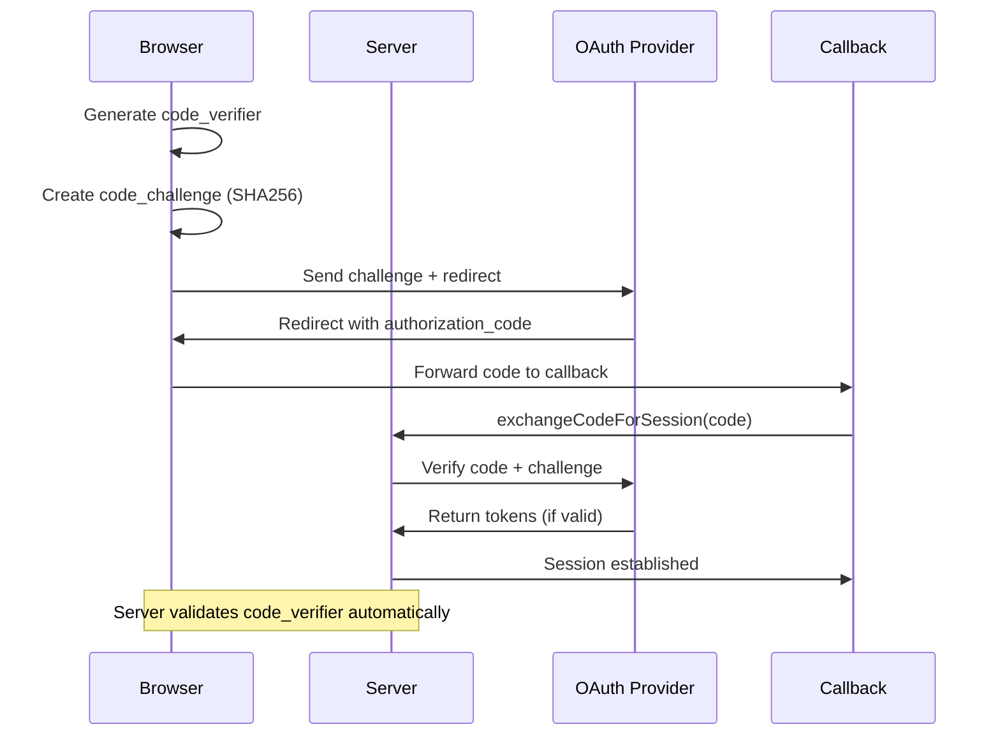
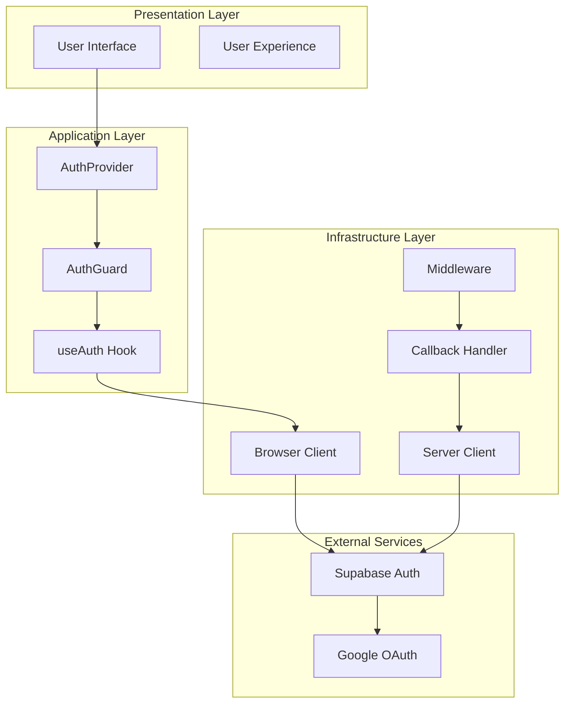
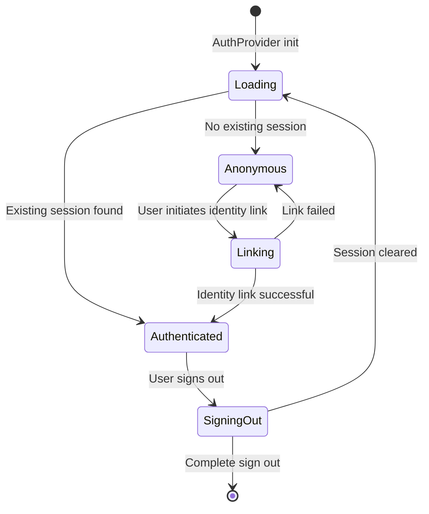

# 🔐 Authentication Flow Knowledge Hub

## Overview

This knowledge hub provides a comprehensive understanding of our Supabase authentication system with PKCE security, anonymous user flows, and seamless identity linking. Focus on conceptual understanding and system architecture.

## 🎯 Core Concepts

### Authentication States



### System Architecture



## 🔄 Authentication Flow Diagrams

### 1. Application Bootstrap Sequence



**Conceptual Flow:**

- **Provider Layer:** Manages global auth state
- **Guard Layer:** Prevents render until auth is ready
- **Auto Anonymous:** Immediate app access without signup
- **Session Persistence:** Automatic session recovery

### 2. Anonymous User Lifecycle



**Key Characteristics:**

- **Zero Friction:** No signup forms or email verification
- **Full Access:** Same permissions as authenticated users
- **Data Preservation:** All user data survives identity upgrade
- **Temporary Identity:** UUID-based with metadata tracking

### 3. Identity Linking Flow



**Upgrade Process:**

- **Anonymous Preservation:** Original user ID maintained
- **Identity Addition:** Google identity linked to existing account
- **Seamless Transition:** No data loss or service interruption
- **Enhanced Features:** Access to authenticated-only features

### 4. PKCE Security Protocol



**Security Benefits:**

- **Authorization Code Protection:** Prevents code interception attacks
- **Server-Side Validation:** Code verifier never exposed to client
- **Perfect Forward Secrecy:** Each OAuth flow uses unique verifier
- **End-to-End Security:** PKCE protects entire authorization flow

## ⚙️ Configuration Hub

### Browser Client Setup

```yaml
# lib/supabase/client.ts
auth:
  autoRefreshToken: true
  persistSession: true
  detectSessionInUrl: true
  flowType: "pkce" # Required for security
  debug: true # Development only
  # ❌ DO NOT set custom storageKey
```

**Purpose:** Handles client-side OAuth initiation and session management

### Server Client Setup

```yaml
# lib/supabase/server.ts
cookies:
  getAll: () => cookieStore.getAll()
  setAll: (cookies) => setCookies(cookies)

auth:
  flowType: "pkce" # Required for server validation
  debug: true # Development only
```

**Purpose:** Validates PKCE challenges and exchanges authorization codes

### Middleware Configuration

```yaml
# middleware.ts
matcher:
  [
    '/((?!_next/static|_next/image|favicon.ico|auth/|.*\\.(?:svg|png|jpg|jpeg|gif|webp)$).*)',
  ]
```

**Purpose:** Protects routes while allowing OAuth callbacks to bypass middleware

### OAuth Callback Logic

```yaml
# app/auth/callback/route.ts
Flow: 1. Detect existing session type (anonymous vs authenticated)
  2. Exchange authorization code using PKCE
  3. Handle identity linking vs initial authentication
  4. Redirect based on success/failure
```

**Purpose:** Server-side token exchange and session establishment

## 🔍 Conceptual Deep Dives

### Anonymous User Philosophy

**Why Anonymous First?**

- **Reduces Friction:** No signup barriers for first-time users
- **Immediate Value:** Users can start using the app instantly
- **Progressive Engagement:** Upgrade to authenticated when user sees value
- **Data Continuity:** Seamless transition without losing work

**Anonymous User Characteristics:**

- **Temporary Identity:** UUID-based, no personal information required
- **Full Feature Access:** Same capabilities as authenticated users
- **Session Persistence:** Survives browser refreshes and short absences
- **Upgrade Path:** Smooth transition to authenticated state

### Identity Linking Strategy

**Anonymous → Authenticated Upgrade:**

- **Data Preservation:** All user data (chats, settings, preferences) maintained
- **Identity Merging:** Google identity linked to existing anonymous account
- **Seamless Experience:** No interruption in user workflow
- **Enhanced Features:** Unlock authenticated-only capabilities

**Linking Flow:**

1. User clicks "Link Google Account"
2. Redirected to Google OAuth approval
3. User grants permissions
4. Returns to app with authorization code
5. Server validates and links identity
6. User now authenticated with preserved data

### PKCE Security Model

**Challenge-Response Protocol:**

- **Code Verifier:** Secret random string (128+ characters)
- **Code Challenge:** SHA256 hash of verifier (base64url encoded)
- **OAuth Initiation:** Challenge sent to provider, verifier stored locally
- **Callback Validation:** Server retrieves verifier to prove request legitimacy

**Security Properties:**

- **Interception Resistance:** Attacker with code cannot exchange without verifier
- **Server Validation:** OAuth provider verifies challenge/verifier pair
- **Unique Per Flow:** Each OAuth request uses different verifier
- **Client Isolation:** Verifier never transmitted in clear text

## 🏗️ Architecture Patterns

### Layered Architecture



### State Management Flow



## 🚨 Troubleshooting Matrix

### Common Issues & Solutions

| Issue              | Symptom               | Root Cause                  | Solution                     |
| ------------------ | --------------------- | --------------------------- | ---------------------------- |
| PKCE Error         | "code verifier" error | Server client misconfigured | Enable PKCE on server client |
| Cookie Mismatch    | Verifier not found    | Custom storage keys         | Remove custom storageKey     |
| Middleware Block   | Auth routes blocked   | Middleware too broad        | Exclude `/auth/**` routes    |
| Session Loss       | Unexpected sign out   | Cookie expiry               | Check cookie settings        |
| Identity Link Fail | Upgrade doesn't work  | Session state issues        | Verify anonymous session     |

### Debug Checklist

**PKCE Verification:**

- ✅ Browser client has `flowType: 'pkce'`
- ✅ Server client has `flowType: 'pkce'`
- ✅ No custom `storageKey` configured
- ✅ `/auth/**` routes excluded from middleware
- ✅ Cookies accessible to server client

**Session Management:**

- ✅ Anonymous users created successfully
- ✅ Existing sessions recovered on app load
- ✅ Identity linking preserves user data
- ✅ Sign out clears all session data

## 📊 Metrics & Monitoring

### Key Performance Indicators

- **Anonymous Sign-in Rate:** Percentage of users who start anonymously
- **Identity Linking Rate:** Percentage of anonymous users who upgrade
- **PKCE Success Rate:** Percentage of successful OAuth flows
- **Session Recovery Rate:** Percentage of returning users with valid sessions

### Error Tracking

- **PKCE Validation Failures:** Code verifier issues
- **OAuth Provider Errors:** Google API issues
- **Session Recovery Failures:** Cookie/storage problems
- **Identity Linking Errors:** Session state conflicts

## 🔄 Future Enhancements

### Planned Features

1. **Multi-Provider Support**

   - GitHub, Discord, Twitter OAuth
   - Unified identity management
   - Provider preference settings

2. **Advanced Session Management**

   - Configurable session timeouts
   - Device management and tracking
   - Session invalidation controls

3. **Enhanced Security**

   - MFA support for authenticated users
   - Device fingerprinting
   - Suspicious activity detection

4. **User Experience Improvements**
   - Progressive authentication prompts
   - Account linking reminders
   - Seamless re-authentication flows

---

## 📚 Quick Reference

| Component        | Purpose            | Configuration Key     |
| ---------------- | ------------------ | --------------------- |
| AuthProvider     | Global auth state  | Context provider      |
| AuthGuard        | Loading protection | Conditional rendering |
| useAuth Hook     | State access       | Hook interface        |
| Browser Client   | OAuth initiation   | PKCE enabled          |
| Server Client    | Token validation   | PKCE enabled          |
| Middleware       | Route protection   | Auth route exclusion  |
| Callback Handler | Token exchange     | Session establishment |

| State           | Characteristics   | Capabilities      |
| --------------- | ----------------- | ----------------- |
| Unauthenticated | No session        | Basic access only |
| Anonymous       | Temporary session | Full app access   |
| Authenticated   | Google identity   | Enhanced features |

---

_This knowledge hub is maintained to ensure system reliability and developer understanding. Updated with latest architectural patterns and security practices._
