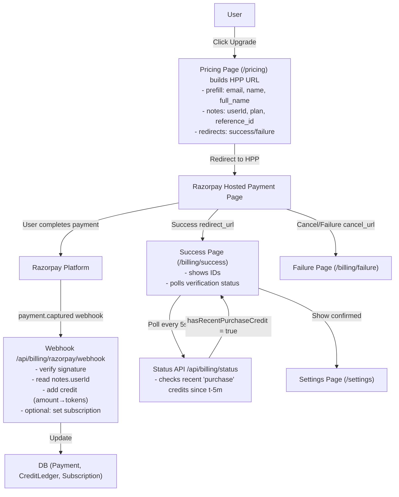

# Payment Flow - Razorpay Hosted Payment Pages

## Architecture Overview

## Key Components

- **Hosted Payment Page**: Razorpay-hosted checkout with prefilled user data
- **Webhook**: Source of truth for payment verification and user crediting
- **Success Verification**: Polls DB status until webhook processes payment
- **Database Tables**: Payment, CreditLedger, Subscription for tracking
